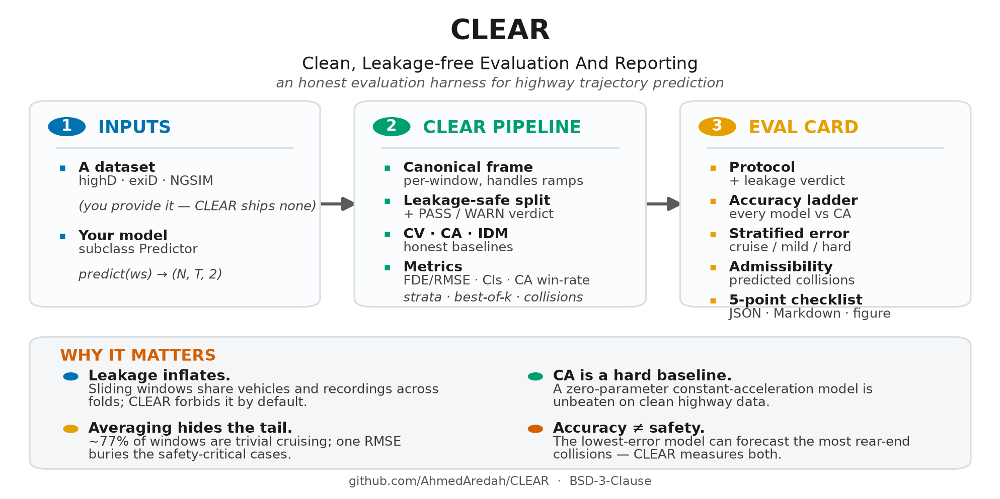

# CLEAR — Clean, Leakage-free Evaluation And Reporting

[](https://github.com/AhmedAredah/CLEAR/actions/workflows/ci.yml)
[](LICENSE)
[](pyproject.toml)
[](https://doi.org/10.5281/zenodo.20800658)

An open toolkit for **honest, leakage-free** evaluation of highway vehicle-trajectory prediction.
It anchors every model against the zero/low-parameter baselines — constant velocity, **constant
acceleration**, and the Intelligent Driver Model — under a recording-/vehicle-disjoint split, and
emits a standardized **Eval Card** that forces disclosure of the things that otherwise inflate
reported numbers: the baseline set, the split, the scoring convention, stratified error, and a
predicted-collision admissibility metric.

Reference implementation for the paper *"Constant Acceleration Is a Hard Baseline: A Leakage-Free
Re-Evaluation of Highway Vehicle-Trajectory-Prediction Benchmarks."*



## Why
- **Leakage inflates.** Sliding windows share vehicles/recordings across folds; CLEAR forbids it by
  default and prints a `PASS-CLEAN` / `WARN-LEAKY` verdict.
- **CA is a hard baseline.** A zero-parameter constant-acceleration model is unbeaten by trained
  models — including official published architectures — on clean highway data (highD, exiD).
- **Averaging hides the tail.** ~77% of windows are trivial cruising; a single RMSE buries the
  safety-critical cases, so CLEAR reports difficulty-stratified error.
- **Accuracy ≠ safety.** The lowest-error model can forecast the most rear-end collisions; CLEAR
  measures predicted-collision admissibility alongside displacement error.

## Install
```bash
pip install -e .            # core (NumPy only)
pip install -e ".[figures]" # + matplotlib for card figures
pip install -e ".[deep]"    # + torch for the official CS-LSTM/STDAN adapters
```

> **No data ships with CLEAR.** Obtain highD/exiD (https://levelxdata.com) and NGSIM under their
> own licenses; point the loaders at your local copy.

## Quickstart
```bash
clear run --data /path/to/highD/data --split recording --out card/
# or: python -m clear.cli run --data /path/to/exiD/data --split random   # emits WARN-LEAKY
```
```python
from clear import load_levelx, evaluate, Predictor

ws   = load_levelx("highD/data")              # highD / exiD / inD / rounD / uniD (levelX); load_ngsim for NGSIM
card = evaluate(ws, split="recording", out_dir="card/")
print(card.beats_CA)                          # did your models beat CA @5s?
card.to_markdown("card/evalcard.md"); card.to_figure("card/evalcard.pdf")
```
Plug in any model by subclassing `Predictor`:
```python
class MyModel(Predictor):
    name = "MyModel"
    def predict(self, ws):           # -> (N, HOR, 2)  [lat, long] in the per-window canonical frame
        ...
card = evaluate(ws, models=[MyModel()], split="recording")
```

## Run the official deep models *inside* CLEAR
CS-LSTM / STDAN consume a convolutional social grid that CLEAR builds with `social_grid=True`:
```python
from clear import load_levelx, evaluate
from clear.deep import CSLSTM
ws    = load_levelx("highD/data", social_grid=True)
model = CSLSTM(repo="external/conv-social-pooling", weights="cslstm.tar")  # your clone + weights
card  = evaluate(ws, models=[model], split="recording")
print(card.beats_CA)   # {'CS-LSTM': False} on clean highway data — CA wins
```
CLEAR does not redistribute third-party model code; clone the official repo and point the adapter
at it.

## The Eval Card
1. **Protocol disclosure** — windows, horizon, split + leakage verdict.
2. **Baseline ladder** — FDE (mean/median) & RMSE @1–5 s with bootstrap CIs, skill-over-CV, and the
   **paired CA win-rate**.
3. **Stratified error** — per kinematic regime (cruise/mild/hard) and maneuver, with window shares.
4. **Admissibility** — predicted rear-end-collision rate (overall and hard-braking tail).
5. **Scoring transparency** — best-of-k sweep for multimodal models.
6. **Reporting checklist** — five ticks operationalizing the paper's recommendations.

`python -m clear.repro` regenerates a card per dataset (highD/exiD/NGSIM).

## Reproducibility & tests
```bash
pip install -e ".[dev]" && pytest -q     # data-free unit tests run in CI
```

## Citation
If you use CLEAR, please cite the software (archived on Zenodo) and the paper. See
[`CITATION.cff`](CITATION.cff).

> Aredah, A. *CLEAR: Clean, Leakage-free Evaluation And Reporting for highway trajectory
> prediction* (v0.3.0). Zenodo. https://doi.org/10.5281/zenodo.20800658

## Roadmap
- **v0.3 (current):** levelX + NGSIM adapters, leakage-safe splits, CV/CA/IDM, full metrics +
  admissibility, the Eval Card (JSON/MD/figure), CLI, and the CS-LSTM/STDAN deep adapters.
- **v1.0:** docs site, broader dataset coverage, PyPI release, archived Zenodo DOI.

## License
BSD-3-Clause — see [LICENSE](LICENSE).
